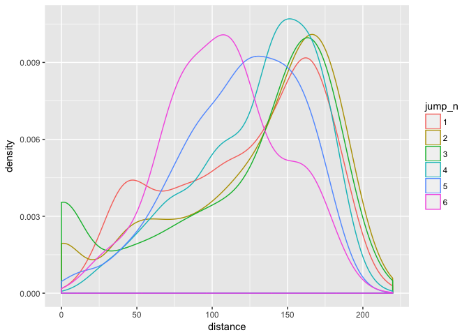

<!-- README.md is generated from README.Rmd. Please edit that file -->
frogs
=====

Data from the Calaveras Jumping Frog Jubilee, as collected for this paper by Astley et al (proper citation coming, on an airplane!): Chasing maximal performance: a cautionary tale from the celebrated jumping frogs of Calaveras County.

DATA IS NOT CLEANED YET! Still under development.

Installation
------------

You can install frogs from github with:

``` r
# install.packages("devtools")
devtools::install_github("jennybc/frogs")
```

Getting to know the frogs
-------------------------

At this point, all we know is that each row is one frog-jump. Frog ids coming ...

``` r
library(frogs)
library(tidyverse)
#> + ggplot2 2.2.1             Date: 2017-05-23
#> + tibble  1.3.1                R: 3.3.2
#> + tidyr   0.6.2.9000          OS: OS X El Capitan 10.11.6
#> + readr   1.1.0              GUI: X11
#> + purrr   0.2.2.9000      Locale: en_CA.UTF-8
#> + dplyr   0.6.0               TZ: America/Vancouver
#> + stringr 1.2.0           
#> + forcats 0.2.0
#> Conflicts -----------------------------------------------------------------
#> * filter(),  from dplyr, masks stats::filter()
#> * lag(),     from dplyr, masks stats::lag()

frogs
#> # A tibble: 3,272 x 15
#>      row distance duration distance_3 jump_n frog_type distance_3_off
#>    <int>    <dbl>    <dbl>      <dbl>  <dbl>     <dbl>          <dbl>
#>  1     1  165.950  0.58333          0      1         3             -1
#>  2     2  177.480  0.71667          0      2         3             -1
#>  3     3    0.000  0.00000          0      3         3             -1
#>  4     4   27.158  0.43333          0      1         3             -1
#>  5     5    0.000  0.00000          0      2         3             -1
#>  6     6    0.000  0.00000          0      3         3             -1
#>  7     7   40.914  0.40000          0      1         3             -1
#>  8     8    0.000  0.00000          0      2         3             -1
#>  9     9    0.000  0.00000          0      3         3             -1
#> 10    10   35.853  0.48333          0      1         3             -1
#> # ... with 3,262 more rows, and 8 more variables: distance_rel <dbl>,
#> #   day <dbl>, angle_01 <dbl>, angle_10 <dbl>, angle_00 <dbl>,
#> #   velocity_01 <dbl>, velocity_10 <dbl>, velocity_00 <dbl>
glimpse(frogs)
#> Observations: 3,272
#> Variables: 15
#> $ row            <int> 1, 2, 3, 4, 5, 6, 7, 8, 9, 10, 11, 12, 13, 14, ...
#> $ distance       <dbl> 165.950, 177.480, 0.000, 27.158, 0.000, 0.000, ...
#> $ duration       <dbl> 0.58333, 0.71667, 0.00000, 0.43333, 0.00000, 0....
#> $ distance_3     <dbl> 0.00, 0.00, 0.00, 0.00, 0.00, 0.00, 0.00, 0.00,...
#> $ jump_n         <dbl> 1, 2, 3, 1, 2, 3, 1, 2, 3, 1, 2, 3, 1, 2, 3, 1,...
#> $ frog_type      <dbl> 3, 3, 3, 3, 3, 3, 3, 3, 3, 3, 3, 3, 3, 3, 3, 3,...
#> $ distance_3_off <dbl> -1, -1, -1, -1, -1, -1, -1, -1, -1, -1, -1, -1,...
#> $ distance_rel   <dbl> 1.00000, 1.06950, 0.00000, 1.00000, 0.00000, 0....
#> $ day            <dbl> 1, 1, 1, 1, 1, 1, 1, 1, 1, 1, 1, 1, 1, 1, 1, 1,...
#> $ angle_01       <dbl> 28.85564, 41.44158, NA, NA, NA, NA, NA, NA, NA,...
#> $ angle_10       <dbl> 24.90057, 37.19646, NA, NA, NA, NA, NA, NA, NA,...
#> $ angle_00       <dbl> 33.03045, 45.62517, NA, NA, NA, NA, NA, NA, NA,...
#> $ velocity_01    <dbl> 3.711031, 3.680306, NA, NA, NA, NA, NA, NA, NA,...
#> $ velocity_10    <dbl> 3.876228, 3.700908, NA, NA, NA, NA, NA, NA, NA,...
#> $ velocity_00    <dbl> 3.599155, 3.702692, NA, NA, NA, NA, NA, NA, NA,...
```

An early figure. Do frogs need to warm up? Do they fatigue? Yes and yes.


