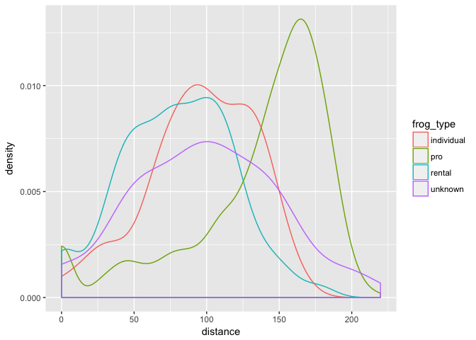

<!-- README.md is generated from README.Rmd. Please edit that file -->
frogs
=====

Data from the Calaveras Jumping Frog Jubilee, as collected for this paper:

Astley, H. C., Abbott, E. M., Azizi, E., Marsh, R. L., and Roberts, T. J. (2013) Chasing maximal performance: a cautionary tale from the celebrated jumping frogs of Calaveras County, *Journal of Experimental Biology* **216**, 3947--3953. <http://dx.doi.org/10.1242/jeb.090357>

> Maximal performance is an essential metric for understanding many aspects of an organism’s biology, but it can be difficult to determine because a measured maximum may reflect only a peak level of effort, not a physiological limit. We used a unique opportunity provided by a frog jumping contest to evaluate the validity of existing laboratory estimates of maximum jumping performance in bullfrogs (*Rana catesbeiana*). We recorded video of 3124 bullfrog jumps over the course of the 4-day contest at the Calaveras County Jumping Frog Jubilee, and determined jump distance from these images and a calibration of the jump arena. Frogs were divided into two groups: ‘rental’ frogs collected by fair organizers and jumped by the general public, and frogs collected and jumped by experienced, ‘professional’ teams. A total of 58% of recorded jumps surpassed the maximum jump distance in the literature (1.295 m), and the longest jump was 2.2 m. Compared with rental frogs, professionally jumped frogs jumped farther, and the distribution of jump distances for this group was skewed towards long jumps. Calculated muscular work, historical records and the skewed distribution of jump distances all suggest that the longest jumps represent the true performance limit for this species. Using resampling, we estimated the probability of observing a given jump distance for various sample sizes, showing that large sample sizes are required to detect rare maximal jumps. These results show the importance of sample size, animal motivation and physiological conditions for accurate maximal performance estimates.

DATA IS NOT CLEANED YET! Still under development.

Installation
------------

You can install frogs from github with:

``` r
# install.packages("devtools")
devtools::install_github("jennybc/frogs")
```

Getting to know the frogs
-------------------------

At this point, all we know is that each row is one frog-jump. Frog ids coming ...

``` r
library(frogs)
library(tidyverse)
#> + ggplot2 2.2.1             Date: 2017-05-24
#> + tibble  1.3.1                R: 3.3.2
#> + tidyr   0.6.2.9000          OS: OS X El Capitan 10.11.6
#> + readr   1.1.0              GUI: X11
#> + purrr   0.2.2.9000      Locale: en_CA.UTF-8
#> + dplyr   0.6.0               TZ: America/Vancouver
#> + stringr 1.2.0           
#> + forcats 0.2.0
#> Conflicts -----------------------------------------------------------------
#> * filter(),  from dplyr, masks stats::filter()
#> * lag(),     from dplyr, masks stats::lag()

frogs
#> # A tibble: 3,272 x 15
#>      row distance duration distance_3 jump_n frog_type distance_3_off
#>    <int>    <dbl>    <dbl>      <dbl>  <int>     <chr>          <dbl>
#>  1     1  165.950  0.58333          0      1       pro             -1
#>  2     2  177.480  0.71667          0      2       pro             -1
#>  3     3    0.000  0.00000          0      3       pro             -1
#>  4     4   27.158  0.43333          0      1       pro             -1
#>  5     5    0.000  0.00000          0      2       pro             -1
#>  6     6    0.000  0.00000          0      3       pro             -1
#>  7     7   40.914  0.40000          0      1       pro             -1
#>  8     8    0.000  0.00000          0      2       pro             -1
#>  9     9    0.000  0.00000          0      3       pro             -1
#> 10    10   35.853  0.48333          0      1       pro             -1
#> # ... with 3,262 more rows, and 8 more variables: distance_rel <dbl>,
#> #   day <dbl>, angle_01 <dbl>, angle_10 <dbl>, angle_00 <dbl>,
#> #   velocity_01 <dbl>, velocity_10 <dbl>, velocity_00 <dbl>
glimpse(frogs)
#> Observations: 3,272
#> Variables: 15
#> $ row            <int> 1, 2, 3, 4, 5, 6, 7, 8, 9, 10, 11, 12, 13, 14, ...
#> $ distance       <dbl> 165.950, 177.480, 0.000, 27.158, 0.000, 0.000, ...
#> $ duration       <dbl> 0.58333, 0.71667, 0.00000, 0.43333, 0.00000, 0....
#> $ distance_3     <dbl> 0.00, 0.00, 0.00, 0.00, 0.00, 0.00, 0.00, 0.00,...
#> $ jump_n         <int> 1, 2, 3, 1, 2, 3, 1, 2, 3, 1, 2, 3, 1, 2, 3, 1,...
#> $ frog_type      <chr> "pro", "pro", "pro", "pro", "pro", "pro", "pro"...
#> $ distance_3_off <dbl> -1, -1, -1, -1, -1, -1, -1, -1, -1, -1, -1, -1,...
#> $ distance_rel   <dbl> 1.00000, 1.06950, 0.00000, 1.00000, 0.00000, 0....
#> $ day            <dbl> 1, 1, 1, 1, 1, 1, 1, 1, 1, 1, 1, 1, 1, 1, 1, 1,...
#> $ angle_01       <dbl> 28.85564, 41.44158, NA, NA, NA, NA, NA, NA, NA,...
#> $ angle_10       <dbl> 24.90057, 37.19646, NA, NA, NA, NA, NA, NA, NA,...
#> $ angle_00       <dbl> 33.03045, 45.62517, NA, NA, NA, NA, NA, NA, NA,...
#> $ velocity_01    <dbl> 3.711031, 3.680306, NA, NA, NA, NA, NA, NA, NA,...
#> $ velocity_10    <dbl> 3.876228, 3.700908, NA, NA, NA, NA, NA, NA, NA,...
#> $ velocity_00    <dbl> 3.599155, 3.702692, NA, NA, NA, NA, NA, NA, NA,...
```

An early figure. Do frogs need to warm up? Do they fatigue? Yes and yes.


Do professional frog jumping teams get better results? YES.


